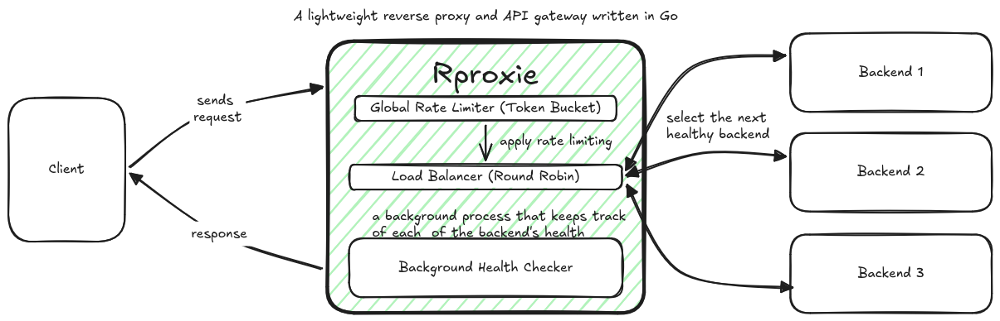

# rproxie

`rproxie` is a lightweight reverse proxy and API gateway written in Go. It forwards HTTP requests to configured backend servers, balances traffic across healthy backends, and applies a token-bucket rate limit.

## Architecture



## Features

- Reverse proxying that forwards the request method, path, query string, body, and headers to a backend and relays its response.
- Thread-safe round-robin backend selection, skipping backends currently marked unhealthy.
- Startup and periodic backend health checks using `GET /health` (a backend is healthy when it responds with HTTP 200).
- A shared token-bucket request limit for the proxy process. Requests over the limit receive HTTP 429.
- Structured logging and graceful shutdown on SIGINT or SIGTERM.

## Requirements

- Go 1.26.5 or later.
- One or more HTTP backends with a `GET /health` endpoint that returns HTTP 200.

## Configuration

The proxy loads configuration from environment variables. It also loads a `.env` file from the current working directory and exits if that file cannot be loaded. Create a `.env` file in the directory where you run the proxy:

```dotenv
PORT=8080
BACKENDS=http://localhost:9001,http://localhost:9002,http://localhost:9003
BUCKET_CAPACITY=100
TOKEN_REFIL_PER_SECOND=10
LOG_LEVEL=INFO
```

`PORT`, `BACKENDS`, `BUCKET_CAPACITY`, and `TOKEN_REFIL_PER_SECOND` are required. `BACKENDS` is a comma-separated list of backend base URLs. `LOG_LEVEL` is optional; supported values are `DEBUG`, `INFO` (the default), `WARN`, and `ERROR`.

The rate limit is process-wide rather than per client. A request consumes one token; tokens refill at `TOKEN_REFIL_PER_SECOND` up to `BUCKET_CAPACITY`.

## Run

From the project root, with `.env` configured:

```sh
go run ./cmd/rproxie
```

The proxy listens on the configured `PORT`. It probes backends at startup and checks their health every five seconds.

## Run with the included test backends

In one terminal, start three local test backends:

```sh
./scripts/run-test-backends.sh
```

In another terminal, use the sample `.env` above and run the proxy. Send a request to it, for example:

```sh
curl -i 'http://localhost:8080/example?hello=world'
```

Each test backend responds with JSON identifying the backend and the request it received. The test backends listen on ports 9001, 9002, and 9003 by default.

## Build

```sh
go build -o ./bin/rproxie ./cmd/rproxie
```

Run the resulting binary from the project root so it can load the `.env` file:

```sh
./bin/rproxie
```

## Project layout

```text
cmd/
  rproxie/       Proxy application entry point
  testbackend/   Small HTTP backend for local development
internal/
  backend/       Backend URL and health state
  config/        Environment-based configuration
  healthchecker/ Periodic backend health checks
  loadbalancer/  Round-robin backend selection
  logger/        Structured logger setup
  ratelimiter/   Token-bucket rate limiter
  rproxy/        HTTP proxy, request handling, and lifecycle
  utils/         JSON error responses and response cleanup
docs/
  rproxie_arch.png
scripts/
  run-test-backends.sh
```
